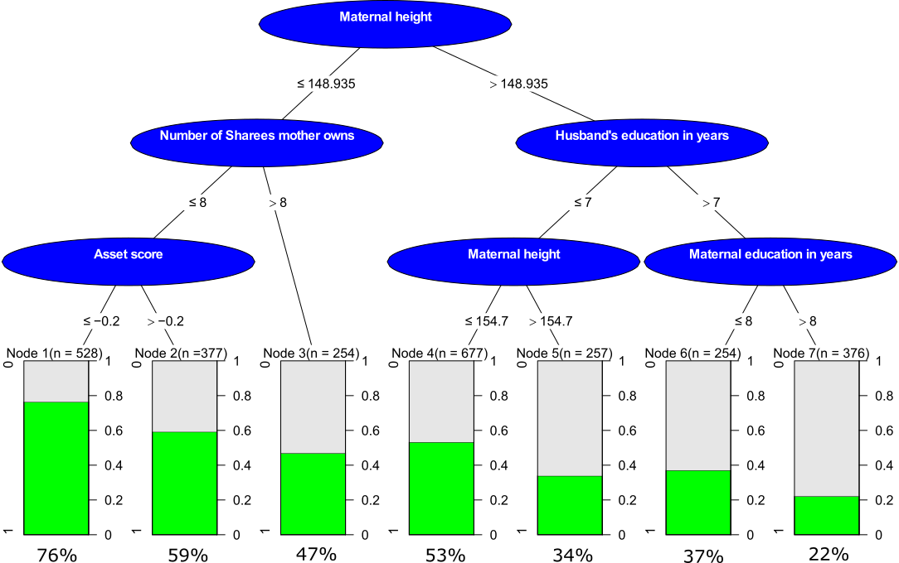

```{r setup, include=FALSE}
knitr::opts_chunk$set(echo = TRUE)
library(ggplot2)
library(tidyverse)
library(dplyr)
library(gridExtra)
library(ggplotlyExtra)
library(plotly)
library(shiny)
```
  
# Assignment 1  
*Sometimes it is necessary to adjust visualizations obtained by complicated R packages and it is difficult to do it programmically. File tree.pdf shows a decision tree created by party package. Use Inkscape to produce a publication quality graph which is like the one shown in Figure 1 (you may make more improvements if you like!).*   
*Note that:*  
*i) Terminal nodes are renumbered*  
*ii) Node numbers and p-values are removed from the non-terminal nodes, title is removed*  
*iii) Percentages are explicitly added below each terminal node and their positions are adjusted appropriately*   
*iv)  Colors are adjusted*  
The first assignment was contributed by Shwetha Vandagadde Chandramouly.
```{r,echo=FALSE, out.width='100%'}

```
  
Assignment 2 is done by Karthikeyan Devarajan.  
# Assignment 2  
*Data set SENIC describes the results of measurements taken at different US hospitals. The description of the variables is given in the accompanying document SENIC.pdf.*   

*1. Read data from SENIC.txt into R*  
```{r,echo=FALSE}
senic <- read.table("SENIC.txt")
names <- c("ID","LOS","Age","Infection_Risk","Routine_Culturing","Routine_Chest","No_Bed","Medical_Affilition","Region","Average_Census","No_Nurses","Availablity_Service")
colnames(senic) <- names
```
  
*2. Create a function that for a given column (vector) X does the following:*  
```{r,echo= FALSE}
given_function <- function(X){
  q_1 <- quantile(X,probs = c(0.25))
  q_2 <- quantile(X,probs = c(0.75))
  upperlimit <- q_2 + (1.5*(q_2 - q_1))
  lowerlimit <- q_1 - (1.5*(q_2 - q_1))
  index <- which(X>upperlimit|X<lowerlimit)
  return(index)
}
``` 
  
*3) ggplot2 and the function from step 2 to create a density plot of Infection risk in which outliers are plotted as a diamond symbol. Make some analysis of this graph.*  

```{r,echo=FALSE}
outlier <- given_function(senic$Infection_Risk)
outlier_df <- tibble(x = senic[outlier,]$Infection_Risk,y=0)
plot_1 <- ggplot(senic,aes(x = Infection_Risk))
plot_1 <- plot_1 + geom_density()
plot_1 <- plot_1 + geom_point(data = outlier_df,mapping = aes(x,y,pch=0),shape=5) + ggtitle("Density of Infection Rate with Outliers")
plot_1
```  
  
The distribution of Infection Risk is normal which can be visualized based on the above graph.The outliers appears to be present in the alpha region.  

*4) Produce graphs of the same kind as in step 3 but for all other quantitative variables in the data (aes_string() can be useful here). Put these graphs into one (hint: arrangeGrob() in gridExtra package can be used) and make some analysis.*  

```{r,echo=FALSE}
new_senic <- senic[,c(1:7,10:12)]
plot_list <- list()
for(i in 1:ncol(new_senic)){
  outlier <- given_function(new_senic[,i])
  outlier_df <- tibble(x = senic[outlier,i],y=0)
  plot_2 <- ggplot()
  plot_2 <- plot_2 + geom_density(aes(x=new_senic[,i]))
  plot_2 <- plot_2 + geom_point(data = outlier_df,mapping = aes(x,y),shape=5,col = "red") + ggtitle("Density") + xlab(colnames(new_senic[i]))
  plot_list[[i]] <- plot_2
}
plot_3 <- arrangeGrob(grobs = plot_list)
plot(plot_3)
```  
  
All graphs seems to be skewed towards the rightside.  

*5) Create a ggplot2 scatter plot showing the dependence of Infection risk on the Number of Nurses where the points are colored by Number of Beds. Is there any interesting information in this plot that was not visible in the plots in step 4? What do you think is a possible danger of having such a color scale?*   
  
```{r,echo=FALSE}
plot_2 <- ggplot(senic,aes(x=No_Nurses,y=Infection_Risk,col=No_Bed)) + geom_point()
plot_2
```  
  
The dependence of the infection risk on number of Nurses based on Number of Bed can be viewed in this graph, which is not possible in previous graph. The infection risk increases with increase in number of nurses and saturates after 200 number of nurses. The number of bed increases with increase in number of nurses and infection risk. The transition of colors cannot be differentiated between some groups.   

*6) Convert graph from step 3 to Plotly with ggplotly function. What important new functionality have you obtained compared to the graph from step 3? Make some additional analysis of the new graph.*  
```{r,echo=FALSE}
ggplotly(plot_1)
```
  
The values of density along with their respective Infection risk and values of Infection risk can be seen.   

*7) Use data plot-pipeline and the pipeline operator to make a histogram of Infection risk in which outliers are plotted as a diamond symbol. Make this plot in the Plotly directly (i.e. without using ggplot2 functionality). Hint: select(), filter() and is.element() functions might be useful here.*  

```{r,echo=FALSE,warning=FALSE}
outlier <- given_function(senic$Infection_Risk)
plot_4 <- senic %>% select('Infection_Risk') %>%
  plot_ly(x=senic$Infection_Risk, type = "histogram",name = "Histogram") %>%
  add_markers(x = senic[outlier,]$Infection_Risk, y = 0,
              marker = list(symbol = "diamond",color = "black"),
              name = "Outliers of Infection Rate") %>%
  layout(title = 'Histogram of Infection Risk')
plot_4
```
      
The histogram with density of infection risk is represented along with the outlier is represented in the above graph.  

*8) Write a Shiny app that produces the same kind of plot as in step 4 but in addition include:*  
*a) Checkboxes indicating for which variables density plots should be produced*  
```{r,echo=FALSE,eval=TRUE,chunk_title='Simple_Shiny'}
given_function <- function(X){
  q_1 <- quantile(X,probs = c(0.25))
  q_2 <- quantile(X,probs = c(0.75))
  upperlimit <- q_2 + (1.5*(q_2 - q_1))
  lowerlimit <- q_1 - (1.5*(q_2 - q_1))
  index <- which(X>upperlimit|X<lowerlimit)
  return(index)
}
senic <- new_senic
variable <- colnames(senic)

ui <- fluidPage(
  checkboxGroupInput("variable","Choose variables for plot", variable,selected = "LOS"),
  sliderInput("bw","Bandwidth Range: ",min = 0.1,max = 1,value = 0.1),
  plotOutput("DensePlot")
)
server <- function(input, output){
  output$DensePlot <- renderPlot({
    selected <- input$variable
    plot_list <- vector("list" , length = length(selected))
    for (i  in 1:length(selected)) {
      outlier <- given_function(senic[,selected[i]])
      outlier_df <- tibble(x=as.numeric(senic[outlier,selected[i]]),y=0)
      plot_list[[i]] <- ggplot() 
      plot_list[[i]] <- plot_list[[i]] + geom_density(data = senic, aes_string(x = selected[i]),bw = input$bw) 
      plot_list[[i]] <- plot_list[[i]] + geom_point(data=outlier_df, aes(x,y),shape=23,size = 3)
    }
    final <- arrangeGrob(grobs = plot_list)
    grid.arrange(final)
    })
}

#shinyApp(ui = ui, server = server)
``` 
  

As the bandwidth increases, all density plotts becomes more smoother.  

  
# Appendix
```{r ref.label=knitr::all_labels(), echo = T, eval = F,warning=F}
```


